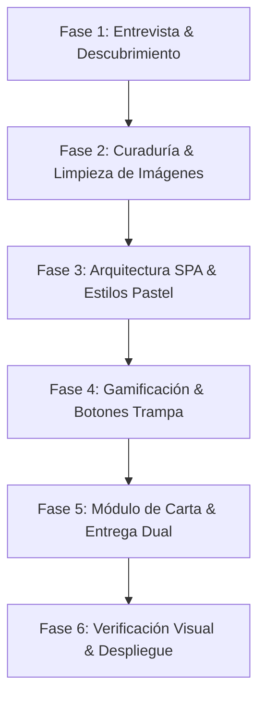

# 💖 Kawaii Sanrio Date Web Architect & Builder

Esta **Mega-Skill** proporciona a Antigravity y a cualquier agente de Inteligencia Artificial las directrices, arquitecturas de software, técnicas de procesamiento gráfico y patrones de interacción lúdica necesarios para construir sitios web románticos e interactivos de nivel profesional, visualmente deslumbrantes y con una experiencia de usuario tierna (estilo Sanrio / Pastel Aesthetic).

---

## 📌 Subdocumentos y Recursos Incluidos

- **Checklist de Entrevista Previa**: [references/interview_checklist.md](references/interview_checklist.md)  
  *Preguntas indispensables antes de codificar (apodos, lugares de la cita, mecánicas de broma, etc.).*
- **Sistema de Diseño Visual Pastel**: [references/design_system.md](references/design_system.md)  
  *Reglas de color, variables CSS, tipografías Google Fonts (`Fredoka`, `Nunito`, `Caveat`) y fondos dinámicos.*
- **Guía de Mecánicas Interactivas**: [references/interactive_mechanics.md](references/interactive_mechanics.md)  
  *Algoritmo de botón fugitivo con fatiga, agujero negro con temblor de pantalla, botón hacker glitch y carta 3D.*
- **Script Limpiador de Transparencias (PIL)**: [scripts/clean_image_backgrounds.py](scripts/clean_image_backgrounds.py)  
  *Eliminación de fondo blanco por flood fill periférico sin recortar bordes de los personajes.*
- **Plantilla de Carta Autónoma**: [resources/template_carta.html](resources/template_carta.html)  
  *Plantilla HTML lista para generar y descargar documentos `carta.html` independientes.*

---

## 🔄 Flujo de Trabajo Operativo en 6 Fases



---

### 🌸 Fase 1: Entrevista y Descubrimiento Proactivo
El agente **NUNCA** debe adivinar detalles íntimos o geográficos. Antes de iniciar la codificación, debe consultar el [Checklist de Entrevista](references/interview_checklist.md) y plantear al usuario preguntas claras y concisas sobre:
1. **Apodo cariñoso** de la pareja (ej. *"mi borreguita"*, *"cielo"*, *"gatita"*).
2. **Estado o contexto** especial (ej. si está malita de la garganta, mimitos, aniversario).
3. **Puntos clave de la cita**: nombres y direcciones físicas de los locales (comida, compras, café).
4. **Comportamiento del botón trampa**: qué debe ocurrir si logra pulsarlo (¿agujero negro? ¿mensaje cómico?).
5. **Música de fondo**: existencia de archivo `.mp3` para la atmósfera.
6. **Canal de recepción preferido**: email directo, descarga de archivo o WhatsApp.

---

### 🎨 Fase 2: Curaduría y Limpieza Gráfica de Imágenes
Para evitar que las ilustraciones se vean pixeladas, con fondos blancos cuadrados o bordes cortados:
1. **Generación con IA (`generate_image`)**:
   - Siempre solicitar fondos completamente blancos lisos y contornos definidos de color marrón suave:  
     *Prompt clave*: `Cute kawaii [personaje/objeto], pastel colors, thick soft brown outlines, Sanrio-like flat vector sticker style, isolated on plain pure white background, no text`.
2. **Procesamiento Quirúrgico con Python/Pillow**:
   - Ejecutar el script [clean_image_backgrounds.py](scripts/clean_image_backgrounds.py):
     ```bash
     python skill/scripts/clean_image_backgrounds.py --input carpeta_origen --output img/ --threshold 40
     ```
   - **Técnica utilizada**: Flood fill desde 16 puntos periféricos y esquinas hacia adentro con tolerancia (threshold). Esto **preserva los blancos interiores** (ojos, barriguita, lana o dientes del personaje) mientras elimina el fondo exterior al 100%.
   - **Autocrop**: Recorte automático por `im.getbbox()` para eliminar márgenes vacíos y optimizar el centrado.

---

### 🍬 Fase 3: Arquitectura SPA y Sistema de Diseño
Construir una **Single Page Application (SPA)** ligera en HTML5, CSS3 moderno y Vanilla JavaScript:
1. **Estructura Modular por Pantallas**:
   - `<section id="home" class="screen active">`: Portada cariñosa con la mascota principal saludando.
   - `<section id="map-screen" class="screen">`: Pantalla con el mapa interactivo de Usera / ciudad de la cita.
   - `<section id="letter-screen" class="screen">`: Pantalla con la carta mágica animada.
   - `<div id="basket-panel" class="overlay hidden">`: Canasta fija de picnic para guardar y descargar cartas.
2. **Reglas de Estilo Inquebrantables**:
   - **Cero Negro Puro**: Reemplazar `#000000` por marrón `#7a4a3a`.
   - **Tipografía Fredoka + Nunito + Caveat**: Importadas desde Google Fonts.
   - **Fondo Vivo Multicapa**: Polka-dots radiales + nubes CSS a la deriva + lluvia suave de emojis (`#falling`).
   - **Audio amigable**: Iniciar en silencio hasta la primera pulsación táctil (`pointerdown`) para respetar las políticas de seguridad del navegador.

---

### 🕹️ Fase 4: Gamificación y Botones Trampa

#### 1. Botón Fugitivo con Fatiga (Ej. iPhone 15 Rosa)
- Calcular distancia euclidiana en `mousemove`.
- Si `distancia < radio + margen`, reposicionar aleatoriamente asegurando una distancia mínima de salto (`> 200px`).
- Cambiar secuencialmente el texto del botón por frases divertidas.
- **Mecánica de Fatiga**: Tras varios intentos fallidos, pausar el movimiento durante 1.5s mostrando *"Uff… me canso 😮‍💨"*.
- **Vórtice de Agujero Negro**: Si el usuario lo presiona, generar un div con gradiente radial cósmico que absorba el botón mediante `rotate(900deg) scale(0)` y sacuda la pantalla (`screen-shake`).

#### 2. Botón Hacker con Teletransporte Glitch (Ej. Botón "No")
- En vez de deslizarse, aplicar `clip-path` y `skewX` para simular corrupción digital.
- Desplegar mensajes flotantes en consola verde neón (`ACCESS DENIED`, `404: "No" not found`, `sudo say yes`).
- Reaparecer en otra coordenada en 180ms.

#### 3. Mapa Leaflet con Pines Temáticos
- Utilizar capas de OpenStreetMap sin APIs de pago.
- Pines personalizados con forma de lágrima girada (`L.divIcon`) en colores pastel según la actividad.
- Tarjetas inferiores de paso a paso que al hacer click ejecutan `map.flyTo()` y abren el popup con mensaje romántico.
- Botón *"¡Vamos! 💖"* que desata confeti de corazones en Canvas.

---

### 💌 Fase 5: Módulo de Carta y Entrega Dual

1. **Apertura Física del Sobre**:
   - El sobre vibra elásticamente con `animation: shakeEnv`.
   - Se disuelve y emerge la libreta desde abajo (`animation: sheetUp`).
2. **Hoja de Notas Realista**:
   - Renglones horizontales rosas espaciados exactamente a 37px con degradado repetitivo.
   - Margen izquierdo con corazones `♡ ♡ ♡`.
   - Textarea transparente auto-expandible mediante cálculo de `scrollHeight`.
3. **Entrega Dual Robusta**:
   - **Vía A (Email Transparente)**: Envío AJAX silencioso mediante `fetch('https://formsubmit.co/ajax/EMAIL')`.
   - **Vía B (Canasta + Descarga + WhatsApp)**:
     - El sobre vuela animado hacia la canasta (`flying-letter`) e incrementa el contador con efecto `bump`.
     - Se almacena en `localStorage`.
     - Permite descargar la carta como archivo independiente estilizado `carta.html`.
     - En dispositivos móviles, utiliza `navigator.share({ files: [file] })` para enviar el archivo directamente por **WhatsApp**.

---

### 🚀 Fase 6: Verificación y Despliegue en Producción

1. **Auditoría Visual Headless**:
   - Tomar capturas de pantalla con navegador headless (Microsoft Edge / Chrome) en resolución de escritorio (1280x900) y móvil (390x844).
   - Verificar que no existan desbordamientos horizontales ni textos superpuestos.
2. **Despliegue Gratuito en GitHub Pages**:
   - Inicializar repositorio Git, configurar rama `main`, añadir remoto y realizar push.
   - Recordar al usuario la activación en **Settings > Pages > Branch: main**.
   - Enviar la carta de prueba para confirmar la activación de FormSubmit en el correo receptor.

---

## 💎 Reglas de Oro para la IA

> [!IMPORTANT]
> - **Nunca saltes la fase de preguntas**: Una web genérica no conmueve; lo que hace inolvidable este regalo son los detalles específicos (el apodo exacto, el café favorito, el chiste interno).
> - **Los fondos blancos en PNGs destruyen la magia**: Toda ilustración debe pasar por el script de transparencia con flood fill periférico antes de incluirse en el diseño.
> - **Piensa siempre Mobile-First**: El 90% de las parejas abrirá el enlace desde su teléfono móvil. Las animaciones deben ser fluidas y soportar eventos `touchstart` sin romper el scroll.
